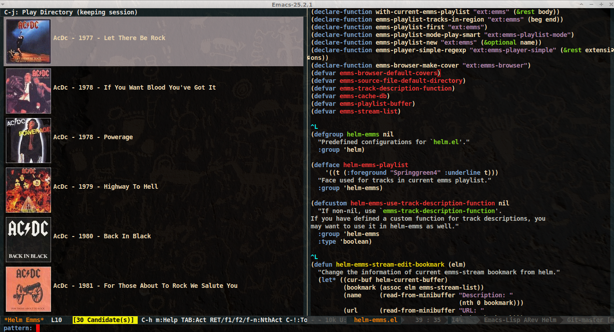

# helm-emms

Basic helm interface to [emms](https://www.gnu.org/software/emms/)

# Dependencies

This package require `emms` and `helm`.

# Install

You can get it from Melpa, otherwise when installing from source,
ensure all dependencies are installed and working, then put
"helm-emms.el" somewhere in your load-path, compile it and require
`helm-emms`, or even better use `(autoload 'helm-emms "helm-emms" nil t)`.

# Usage

Ensure first `emms` is working as expected, and configure it as described at
[Emms home page](https://www.gnu.org/software/emms/)

Then M-x helm-emms.

That's all, have fun.
